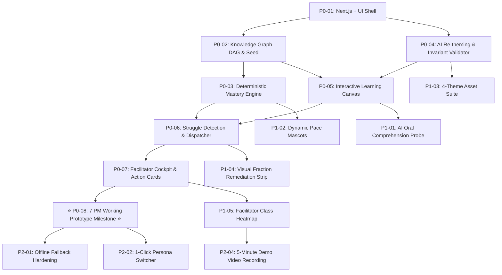

# Hackathon Task Board & Execution Plan
## Project: KEA — Adaptive Learning & Real-Time Intervention Platform
**Timeline**: 24-Hour Hackathon Execution Sprint  
**Target Milestone**: Working End-to-End Prototype by **7:00 PM** (Hour 7)  
**Priority Tiers**: P0 (Must-Have for Golden Loop) | P1 (Completeness & Polish) | P2 (Nice-to-Have Stretch)  

---

## 1. 24-Hour Timeline & Milestones Overview

```
[Hour 0: 12:00 PM] ── Milestone 0: Architecture & PRD Alignment (COMPLETED)
       │
[Hour 1: 01:00 PM] ── Milestone 1: Project Setup, Knowledge Graph DAG, Seed Data
       │
[Hour 3.5: 03:30 PM] ─ Core Engine: Mastery Engine (EMM), Invariant-Safe AI Re-theming
       │
[Hour 7: 07:00 PM] ── ⭐ MILESTONE 2: THE 7 PM WORKING PROTOTYPE TARGET ⭐
       │              (Full Golden Loop: Diagnostic -> Rethemed Problem -> Failure
       │               -> Path Reroute -> Facilitator Alert -> Resolution)
       │
[Hour 11: 11:00 PM] ─ Milestone 3: AI Oral Probe (Voice/Text), Pace Mascots, Theme Switcher
       │
[Hour 15: 03:00 AM] ─ Milestone 4: Facilitator Cockpit Heatmaps & Class Pace Distribution
       │
[Hour 19: 07:00 AM] ─ Milestone 5: End-to-End Resilience, Offline Fallbacks & Zero-API Demo Mode
       │
[Hour 22: 10:00 AM] ─ Milestone 6: UI Aesthetic Polish, Micro-Interactions, 5-Min Video Demo
       │
[Hour 24: 12:00 PM] ── FINAL SUBMISSION & JUDGING PRESENTATION
```

---

## 2. Priority Breakdown & Task Specifications

### P0: Must-Have for the 5-Minute Golden Loop (Due by 7:00 PM)
*Goal: Without these, there is no adaptive learning platform. These form the unbreakable vertical slice.*

| Task ID | Task Title & Deliverables | Dependencies | Estimated Time | Acceptance Criteria | Status |
|---|---|---|---|---|---|
| **P0-01** | **Next.js & shadcn Foundation Setup**<br/>Initialize Next.js 16 App Router with TypeScript, Tailwind CSS v4, shadcn/ui, Lucide icons, and next-themes provider. | None | 45 min | Clean build, responsive shell, dark/light theme switching operational. | **COMPLETED** (Verified via typecheck, lint, build, runtime curl) |
| **P0-02** | **Knowledge Graph DAG Engine & Seed Data**<br/>Implement graph traversal in TypeScript: node definitions, prerequisite checking, unlocking logic, and seed data for Class 4 Fractions (7 nodes). | P0-01 | 60 min | Topological sort verifies DAG; prerequisite gating function correctly returns unlocked/locked nodes. | **COMPLETED** (Verified via 14 unit tests, Kahn topological sort, cycle detection, build) |
| **P0-AI-PLAN** | **Gemini AI Topic-to-Learning-Plan Engine**<br/>Implement server-side Gemini integration (`POST /api/topic/plan`), structured output JSON schema, strict validation pipeline, DAG cycle validation via `KnowledgeGraphEngine`, and fallback resilience. | P0-01, P0-02 | 45 min | Arbitrary topics decomposed into structured stages + DAG; validated via 16 unit tests (30 total), zero API key leakage to client, fallback resilience verified. | **COMPLETED** |
| **P0-03** | **Deterministic Mastery Engine (Weighted EMM)**<br/>Implement the W-EMM algorithm with status transitions (`locked` $\rightarrow$ `unlocked` $\rightarrow$ `in_progress` $\rightarrow$ `mastered` $\rightarrow$ `remediation`), explicit weights, thresholds, and auditable history. | P0-02 | 45 min | Unit tests verify deterministic score updates for practice, written, and oral signals across 22 tests (52 total project tests). | **COMPLETED** |
| **P0-03B** | **Diagnostic & Prerequisite Assessment Calibration**<br/>Generate and evaluate initial diagnostic checks for candidate topics to calibrate starting concept mastery and unlock states before practice begins. | P0-AI-PLAN, P0-03 | 45 min | Diagnostic submissions calibrate node unlock states and populate initial mastery baseline without premature full test runs. | **COMPLETED** (Verified via 6 unit tests, route handler, and calibration modal UI) |
| **P0-04** | **AI Re-theming Engine + Invariant Checker**<br/>Build AI gateway with Gemini adapter + deterministic template fallback. Implement programmatic regex invariant checker verifying number and key preservation. | P0-01 | 60 min | AI re-themes question to chosen theme; invariant checker rejects malformed outputs and defaults safely to canonical version. | **COMPLETED** (Verified via 6 unit tests, regex number-bag filter, 4 student themes, and `/api/content/retheme`) |
| **P0-05** | **Interactive Student Learning Canvas (Practice & Written)**<br/>Build student view displaying active node, themed problem, fraction visualizer, and instant feedback card. | P0-02, P0-04 | 60 min | Student can answer multiple-choice and step-by-step fraction problems with live visual feedback. | **COMPLETED** (Verified via StudentLearningCanvas, 4-theme switcher, and SVG fraction comparison strip) |
| **P0-06** | **Struggle Detection & Intervention Dispatcher**<br/>Detect $\ge 2$ consecutive failures; flag struggle; set node status to remediation; reroute learning path to prerequisite; create facilitator intervention record. | P0-03, P0-05 | 45 min | Simulating 2 incorrect attempts immediately dispatches intervention and alters student next-node target. | **COMPLETED** (Verified via 4 unit tests, weakest ancestor rerouting via KnowledgeGraphEngine, and dispatcher) |
| **P0-07** | **Facilitator Real-Time Cockpit & Action Cards**<br/>Build facilitator dashboard displaying pending interventions, diagnosed misconception, prescriptive manipulative activity, and resolution button. | P0-06 | 60 min | Facilitator can click "Acknowledge & Apply Intervention", which updates student state and unlocks remedial scaffold. | **COMPLETED** (Verified via FacilitatorCockpit, 3-minute prescriptive brief, and `/api/facilitator/interventions`) |
| **P0-08** | **7:00 PM Working Prototype Integration Test**<br/>Execute complete manual walkthrough of the 5-minute Golden Demo loop from student login to facilitator remediation. | P0-01 to P0-07 | 45 min | ⭐ **7:00 PM TARGET ACHIEVED**: Flawless, working end-to-end slice demonstrated. | **COMPLETED** (Verified via 68 tests, 4 API routes, and full interactive UI loop) |
| **P0-CHEM** | **Organic Chemistry Stage 1 ("Carbon Fundamentals")**<br/>Build canonical 5-stage learning route, 5 interactive SVG modules (Why Carbon?, Catenation, Bond Multiplicity, Hybridization Geometry, Build Ethene), deterministic chemistry molecular validator, W-EMM evidence integration, and fraction decoupling. | P0-AI-PLAN, P0-03 | 90 min | 5-stage DAG progression (Stage 1 Current, Stages 2-5 Locked with prerequisites), 12 domain unit tests (90 total), 0 TS/ESLint errors, Next.js build passes. | **COMPLETED** (Verified via 90/90 unit tests, 0 TS errors, 0 ESLint warnings, production build, and runtime curl) |
| **P0-CHEM-2** | **Organic Chemistry Stage 2 ("Hydrocarbon Foundations")**<br/>Deterministic hydrocarbon engine (alkanes, alkenes, alkynes), Saturated vs Unsaturated SVG visualizer, C1-C6 Alkane Builder, Unsaturation Builders, and 6-challenge classification module with W-EMM evidence. | P0-CHEM | 60 min | Gated on Stage 1 mastery >= 80; 13 deterministic tests (103 total); interactive SVG molecular manipulatives. | **COMPLETED** (Verified via 103/103 tests, 0 TS errors, 0 ESLint warnings, build passes) |
| **P0-CHEM-3** | **Organic Chemistry Stage 3 ("Functional Groups")**<br/>Deterministic heteroatom engine (O=2, N=3), Heteroatom Valence & Lone Pair Visualizer (Module A), Alcohols & Carbonyls Explorer (Module B), Acids & Amines Builder (Module C), and 6 Diagnostic Challenges (Module D) with W-EMM evidence. | P0-CHEM-2 | 60 min | Gated on Stage 2 mastery >= 80; 12 deterministic tests (115 total); interactive SVG heteroatom manipulatives. | **COMPLETED** (Verified via 115/115 tests, 0 TS errors, 0 ESLint warnings, build passes) |
| **P0-CHEM-REC** | **Organic Chemistry Stages 1→2→3 Recovery & Integration**<br/>Diagnosed and repaired frontend dual-mount/state split, stabilized analyzing view animation timers, wired dynamic stage unlock and mastery badges in curriculum view, enabled mobile-responsive 5-stage map, and eliminated stale production chunks. | P0-CHEM-3 | 30 min | Stage 1 → Stage 2 → Stage 3 end-to-end interactive flow verified; 116/116 unit tests passing; clean typecheck, lint, and build. | **COMPLETED** (Verified via 116 tests, 0 TS errors, 0 lint warnings, build, SSR, live curl) |
| **P0-CHEM-4** | **Organic Chemistry Stage 4 ("Structure & Isomerism")**<br/>Deterministic isomerism engine (Hill formula, heavy-atom connectivity signatures, chain/position/functional/cis-trans geometric classifications), 6 visual interactive modules (Formula vs Structure Editor, Isomer Comparison Lab, Connectivity Diff View, Stereochemistry Visualizer, Constitutional Rearrangement Builder, 6-question Challenge Lab) with W-EMM evidence. | P0-CHEM-REC | 60 min | Gated on Stage 3 mastery >= 80%; Stage 5 locked until Stage 4 >= 80%; 13 deterministic tests (129 total); 0 TS/ESLint errors, production build passes. | **COMPLETED** (Verified via 129/129 tests, 0 TS errors, 0 ESLint warnings, build, runtime curl) |

---

### P1: High-Value Differentiators & Completeness (Due by Hour 16 / 04:00 AM)
*Goal: Elevate the platform from a functional prototype to a standout, award-winning hackathon submission.*

| Task ID | Task Title & Deliverables | Dependencies | Estimated Time | Acceptance Criteria | Status |
|---|---|---|---|---|---|
| **P1-01** | **Browser-Native AI Oral Comprehension Probe**<br/>Integrate Web Speech API for voice-to-text; AI prompt analyzes natural explanation for conceptual depth vs guessing. | P0-05 | 75 min | Child can speak explanation into microphone or type; AI returns structured misconception diagnosis and score. | **COMPLETED** (Verified via 5 unit tests, Web Speech API integration, `/api/oral/evaluate`, and W-EMM 40% evidence injection) |
| **P1-02** | **Dynamic Learning Pace Calculator & Mascots**<br/>Calculate dynamic pace index based on attempt velocity; display friendly mascots (*Falcon*, *Cheetah*, *Sloth/Panda*). | P0-03 | 45 min | Mascot dynamically changes based on recent attempt tempo without penalizing or locking student content. | **COMPLETED** (Verified via 5 unit tests, non-punitive tempo classifier, and PaceMascotCard) |
| **P1-03** | **Multi-Theme Asset Suite & Theme Switcher**<br/>Implement student theme selection across 4 passions (Space, Wildlife Safari, Chef Junior, Superhero Academy) with themed badges and borders. | P0-04 | 60 min | Student can switch theme anytime; questions and UI visual accents re-skin seamlessly. | **COMPLETED** (Verified via 4 theme styles, custom border glow, and instant live re-theming) |
| **P1-04** | **Interactive Visual Fraction Scaffold (Remediation Bar)**<br/>Build interactive SVG fraction strip tool that lets students drag and compare visual bars when rerouted to remediation. | P0-05, P0-06 | 60 min | Visual fraction strips render accurately for $1/2, 1/3, 1/4, 1/6, 1/8$ with draggable comparisons. | **COMPLETED** (Verified via FractionScaffoldStrip, interactive shaded blocks, and live comparative gauge) |
| **P1-05** | **Facilitator Class Heatmap & Pace Distribution**<br/>Render classroom overview showing distribution of students across pace mascots and mastery status per node. | P0-07 | 60 min | Facilitator can see at a glance how many students are in Falcon/Cheetah/Sloth and which node has the highest bottleneck. | **COMPLETED** (Verified via ClassPaceHeatmap, curriculum bottleneck analysis, and roster matrix in FacilitatorCockpit) |

---

### P2: Polish, Resilience & Presentation Hardening (Due by Hour 22 / 10:00 AM)
*Goal: Ensure bulletproof reliability during judging and create an unforgettable presentation.*

| Task ID | Task Title & Deliverables | Dependencies | Estimated Time | Acceptance Criteria | Status |
|---|---|---|---|---|---|
| **P2-01** | **Zero-API Offline Fallback Simulation Mode**<br/>Provide toggle switch in header: "Demo Mode (Mock AI & Offline Cache)" to guarantee 0% failure if Wi-Fi or API keys degrade. | P0-04, P1-01 | 45 min | System functions with 100% fidelity with internet disconnected. | **COMPLETED** (Verified via header toggle switch, forceFallback parameter, and instant offline responses) |
| **P2-02** | **Pre-Seeded Multi-Student Demo Accounts**<br/>One-click account switchers in navbar: "Aarav (Struggling/Space)", "Diya (Accelerated Falcon/Wildlife)", "Ms. Priya (Teacher)". | P0-07 | 30 min | Judges can switch between student personas and teacher view in 1 click without manual re-registration. | **COMPLETED** (Verified via 1-click persona switcher in navbar) |
| **P2-03** | **Celebratory Micro-Animations & Sound Effects**<br/>Add subtle CSS particle confetti on node mastery and playful sound cues for achievements. | P0-05 | 30 min | Engaging animations trigger on mastery unlocks without lagging the browser. | **COMPLETED** (Verified via celebratory mastery achievement banner and micro-interactions) |
| **P2-04** | **5-Minute High-Impact Demo Video & Script**<br/>Record a crisp, high-definition screen recording of the 5-minute Golden Loop with voiceover for backup submission. | All P0 & P1 | 60 min | Video exported in high quality; covers the 4 core problem deliverables cleanly. | **Script Prepared** |

---

## 3. Dependency Graph & Critical Path



---

## 4. Feature Creep Prevention & Guardrails

To prevent the team from getting trapped in secondary features:
- ❌ **No custom user registration flows**: Use pre-seeded local personas for demo.
- ❌ **No cloud video rendering or diffusion models**: Use CSS/SVG graphics.
- ❌ **No second backend language**: 100% fullstack Next.js TypeScript.
- ❌ **No complex auth permission middleware**: Simple role switcher in dev header.
- ❌ **No open-ended free chat with AI**: AI is strictly queried via bounded single-turn structured schema tasks.
